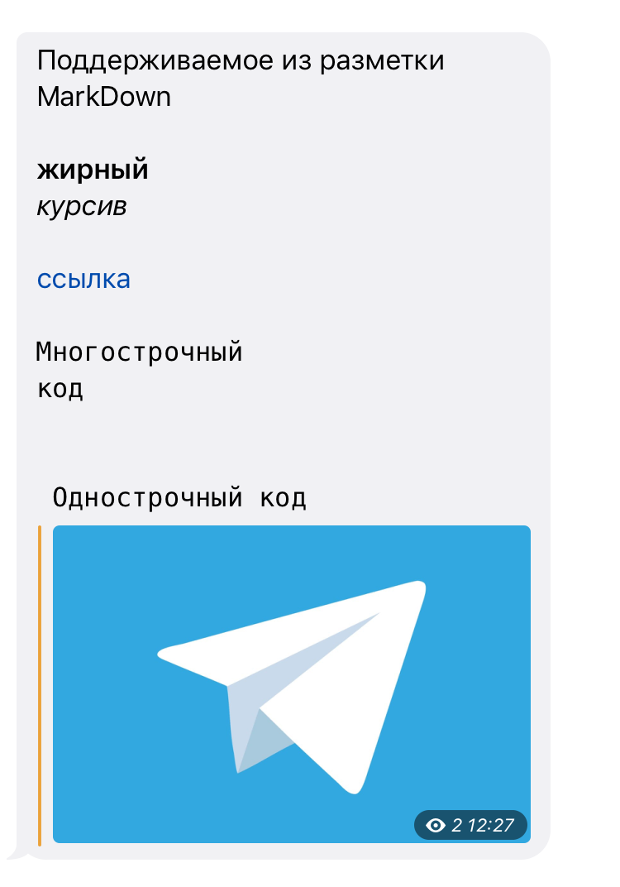
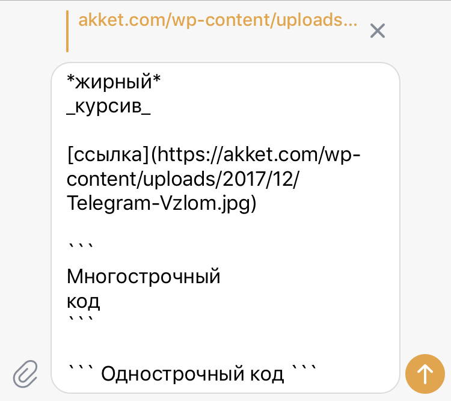
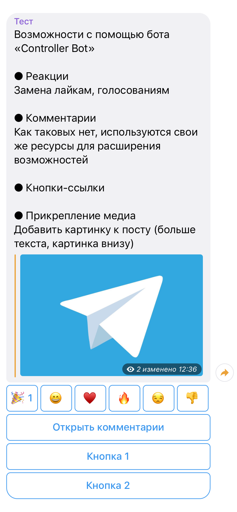
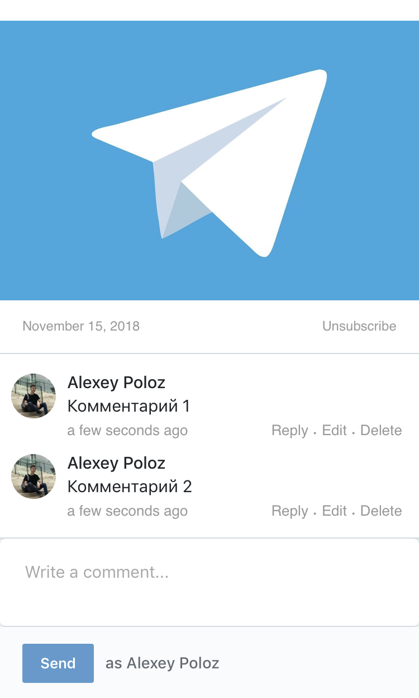
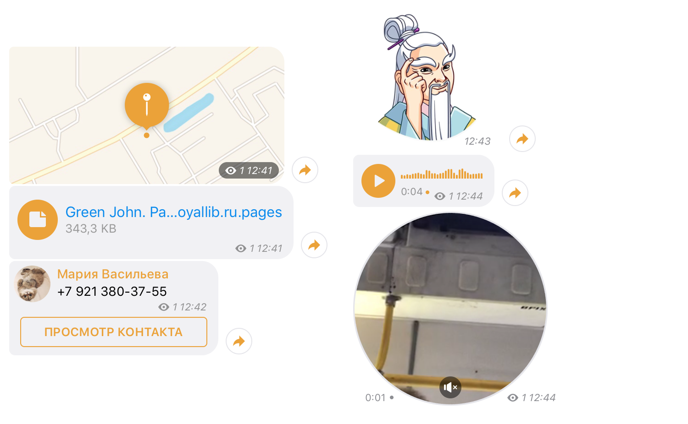

# Анализ Telegram

## Описание
Использование средств Telegram для получения контента и дальнейшего анализа.

### Telegram Bot API 4.1
[Список изменений](https://core.telegram.org/bots/api#august-27-2018)

[API](https://core.telegram.org/bots/api#making-requests)

Используемый пакет: [python-telegram-bot](https://github.com/python-telegram-bot/python-telegram-bot)

Документация по пакету: [ReadTheDocs](https://python-telegram-bot.readthedocs.io/en/stable/)

### Telegram API
[API](https://core.telegram.org/methods)

Используемый пакет: [telethon](https://github.com/LonamiWebs/Telethon)

Документация по пакету: [ReadTheDocs](https://telethon.readthedocs.io/en/stable/), [GitHub](https://lonamiwebs.github.io/Telethon/)

### Telegram Web 0.5.7
[Ссылка](https://web.telegram.org/#/login)

Код: [GitHub](https://github.com/zhukov/webogram)

## Telegram
Описание функций и возможностей

### Сообщение / пост
#### MarkDown

#### Controller Bot

#### Вложения
